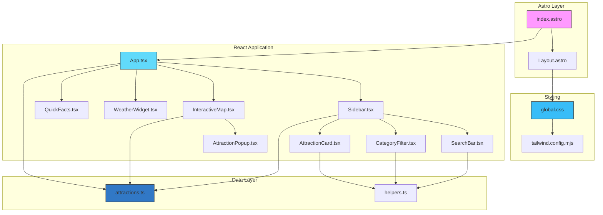
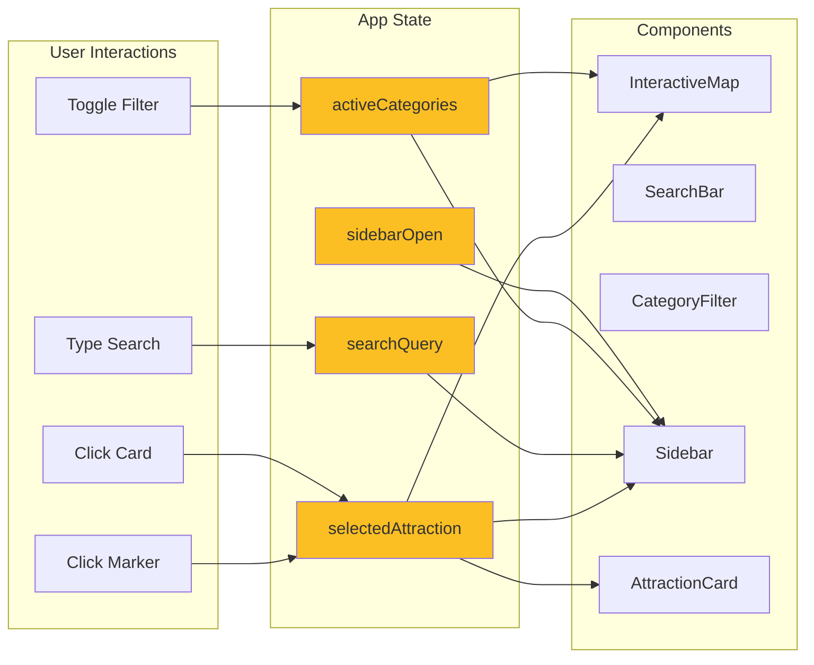
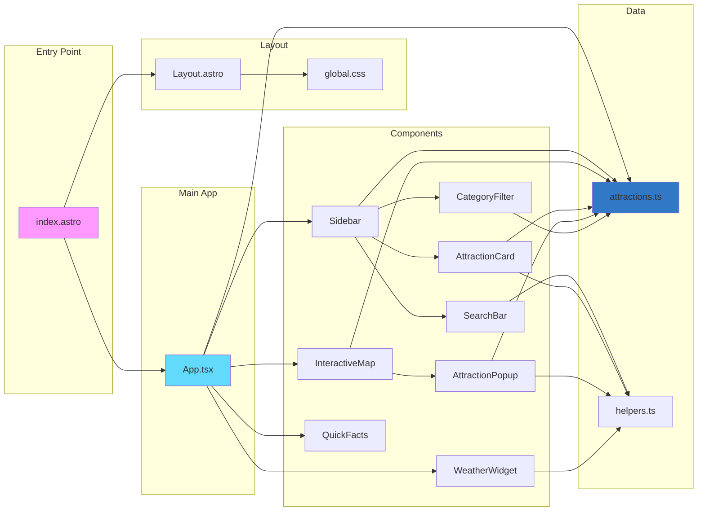
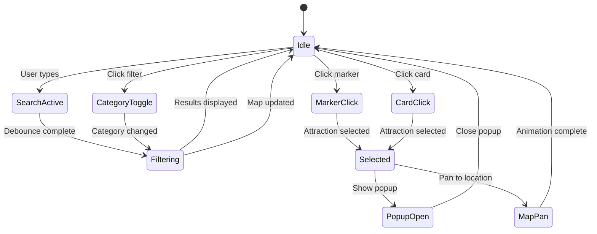
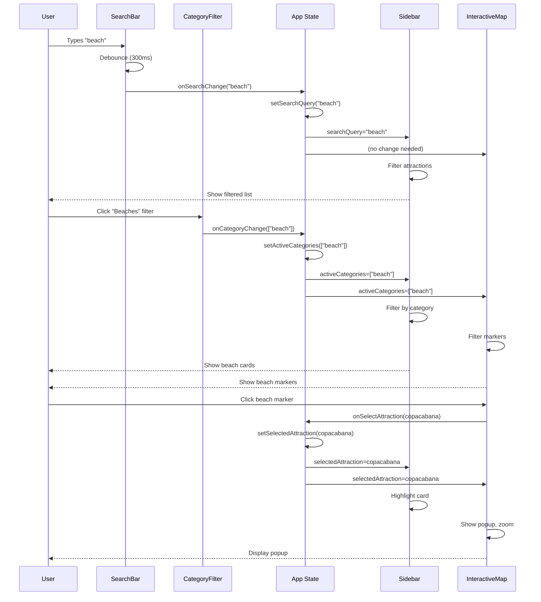
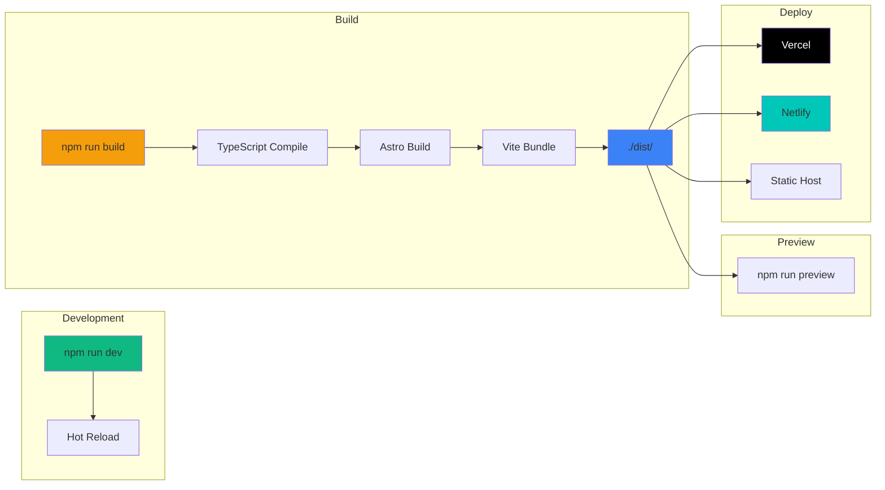

# Architecture Overview

This document provides visual diagrams of the Rio Attractions application architecture.

## Component Dependency Tree

## Data Flow Diagram

## File Structure Visualization

```mermaid
graph TD
    ROOT[rio-attractions/]

    ROOT --> PUBLIC[public/]
    ROOT --> SRC[src/]
    ROOT --> CONFIG[Config Files]

    PUBLIC --> FAV[favicon.svg]
    PUBLIC --> ROB[robots.txt]

    SRC --> COMP[components/]
    SRC --> DATA[data/]
    SRC --> LAYOUTS[layouts/]
    SRC --> PAGES[pages/]
    SRC --> STYLES[styles/]
    SRC --> UTILS[utils/]

    COMP --> APP[App.tsx]
    COMP --> MAP[InteractiveMap.tsx]
    COMP --> SIDE[Sidebar.tsx]
    COMP --> CARD[AttractionCard.tsx]
    COMP --> POP[AttractionPopup.tsx]
    COMP --> CAT[CategoryFilter.tsx]
    COMP --> SEARCH[SearchBar.tsx]
    COMP --> WEATHER[WeatherWidget.tsx]
    COMP --> FACTS[QuickFacts.tsx]

    DATA --> ATTR[attractions.ts]

    LAYOUTS --> LAYOUT[Layout.astro]

    PAGES --> INDEX[index.astro]

    STYLES --> CSS[global.css]

    UTILS --> HELP[helpers.ts]

    CONFIG --> ASTRO[astro.config.mjs]
    CONFIG --> TAIL[tailwind.config.mjs]
    CONFIG --> TS[tsconfig.json]
    CONFIG --> PKG[package.json]

    style ROOT fill:#009739
    style SRC fill:#FEDD00
    style COMP fill:#61dafb
```

## Module Import Relationships

## State Management Flow

## User Interaction Flow

## Performance Optimization Strategy

```mermaid
graph TB
    subgraph "Build Time"
        B1[Tailwind Purge CSS]
        B2[Code Splitting]
        B3[Asset Optimization]
        B4[Sitemap Generation]
    end

    subgraph "Load Time"
        L1[Critical CSS Inlining]
        L2[Lazy Load Map]
        L3[Preconnect Fonts]
        L4[Async Scripts]
    end

    subgraph "Runtime"
        R1[Debounced Search]
        R2[Memoized Components]
        R3[Memoized Computations]
        R4[GPU Animations]
    end

    B1 --> PERF[Performance]
    B2 --> PERF
    B3 --> PERF
    B4 --> SEO[SEO]

    L1 --> FCP[First Contentful Paint]
    L2 --> TTI[Time to Interactive]
    L3 --> FCP
    L4 --> TTI

    R1 --> INP[Interaction to Next Paint]
    R2 --> INP
    R3 --> INP
    R4 --> FPS[60 FPS Animations]

    style PERF fill:#10B981
    style SEO fill:#3B82F6
    style FCP fill:#F59E0B
    style TTI fill:#F59E0B
    style INP fill:#EF4444
    style FPS fill:#8B5CF6
```

## SEO Structure

```mermaid
graph TD
    subgraph "Meta Tags"
        M1[Title]
        M2[Description]
        M3[Canonical]
        M4[Open Graph]
        M5[Twitter Cards]
    end

    subgraph "Structured Data"
        SD1[WebSite Schema]
        SD2[TouristDestination Schema]
    end

    subgraph "Technical SEO"
        T1[robots.txt]
        T2[sitemap.xml]
        T3[Semantic HTML]
        T4[Alt Text]
    end

    subgraph "Performance SEO"
        P1[Core Web Vitals]
        P2[Mobile Friendly]
        P3[HTTPS]
    end

    M1 --> SERP[Search Results]
    M2 --> SERP
    M3 --> RANK[Page Ranking]

    M4 --> SOCIAL[Social Sharing]
    M5 --> SOCIAL

    SD1 --> RICH[Rich Snippets]
    SD2 --> RICH

    T1 --> CRAWL[Crawlability]
    T2 --> CRAWL
    T3 --> ACCESS[Accessibility]
    T4 --> ACCESS

    P1 --> RANK
    P2 --> RANK
    P3 --> RANK

    style SERP fill:#4285F4
    style SOCIAL fill:#1DA1F2
    style RICH fill:#FBBC05
    style CRAWL fill:#34A853
```

## Deployment Pipeline

---

## How to View These Diagrams

These diagrams are written in [Mermaid](https://mermaid.js.org/) syntax. You can view them:

1. **GitHub** - Renders Mermaid diagrams automatically in markdown
2. **VS Code** - Use the "Markdown Preview Mermaid Support" extension
3. **Online** - Paste code at [mermaid.live](https://mermaid.live)
4. **Notion** - Supports Mermaid in code blocks

---

*Architecture diagrams last updated: February 2026*
